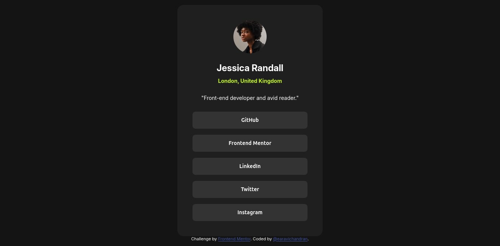

# Frontend Mentor - Social links profile solution

This is a solution to the [Social links profile challenge on Frontend Mentor](https://www.frontendmentor.io/challenges/social-links-profile-UG32l9m6dQ). Frontend Mentor challenges help you improve your coding skills by building realistic projects.

## Table of contents

- [Overview](#overview)
  - [The challenge](#the-challenge)
  - [Screenshot](#screenshot)
  - [Links](#links)
- [My process](#my-process)
  - [Built with](#built-with)
  - [What I learned](#what-i-learned)
- [Author](#author)
- [Acknowledgments](#acknowledgments)

## Overview

### The challenge

Social profile link challenge

- This challenge is given the Frontend Mentor page.

### Screenshot

### Links

- Solution URL: [Social link profile](https://github.com/earavichandran/social-link-profile)
- Live Site URL(Vercel): [Social link profile](https://social-link-profile-two-sable.vercel.app/)

## My process

### Built with

- Semantic HTML5 markup
- CSS custom properties
- Flexbox

### What I learned

In this section, I learned

- Flexbox properties
- Media queries

## Author

- Frontend Mentor - [@earavichandran](https://www.frontendmentor.io/profile/earavichandran)
- My Github account - [@earavichandran](https://github.com/earavichandran)

## Acknowledgments

Thanks to Frontend Mentor team for creating this challenge.
